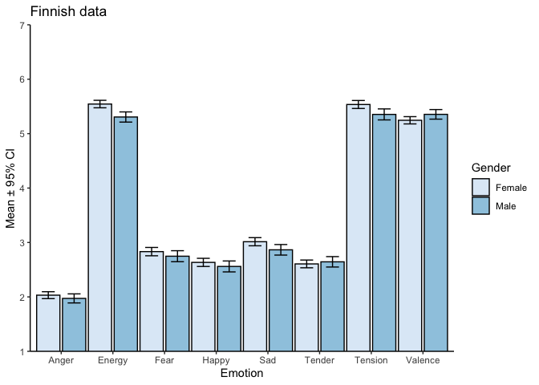
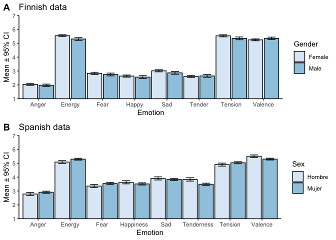

## Finnish data

This is the raw data relating to [Eerola and Vuoskoski
(2011)](https://journals.sagepub.com/doi/10.1177/0305735610362821) film
soundtrack data where a number of participants rated film soundtracks on
basic emotions and dimensional emotion concepts. The data is available
in two files, one for the Finnish participants (Eerola & Vuoskoski,
2011) and one for the Spanish participants ([Fuentes-Sánchez et al.,
2020](https://doi.org/10.1177/0305735620958464)). The Finnish data has
been merged from two separate experiments (discrete and dimensional
emotion ratings). Similar ratings have also been obtained in a study
with French participants ([Nineuil et al.,
2022](https://doi.org/10.1177/03057356211050683)).

Variables in the data:

-   `row` = sequential number of the row in the original data file.
-   `Track` = Track number (1-110).
-   `Category` = Emotion category (Happy, Sad, Tender, Fear, Anger) or
    Neg. Ene., Neg. Ten. Neg. Val. Pos. Ene. Pos. Ten. Pos. Val.
-   `Level` = Level of the emotion (referring to the categories, “High”
    or “Moderate”).
-   `Album` = String of the album name where the track was derived from.
-   `id` = Participant code.
-   `Anger` = rating on Anger (1-9).
-   `Fear` = rating on Fear (1-9).
-   `Happy` = rating on Happy (1-9).
-   `Sad` = rating on Sad (1-9).
-   `Tender` = rating on Tender (1-9).
-   `Gender` = Gender of the participant (“Female” or “Male”).
-   `Age` = Age of the participant (in years).
-   `Musicianship` = Self-reported musicianship (1-3 using simplified
    OMSI categories, see paper).
-   `Emotion` = Emotion framework (“Dimensional” or “Discrete”).
-   `Tension` = rating on Tension (1-9).
-   `Energy` = rating on Energy (1-9).
-   `Valence` = rating on Valence (1-9).

``` r
d <- read.csv('FIN_merged_rawdata.csv')

d2 <- d %>%
group_by (Track) %>% 
summarise(Category = first(Category),Level = first(Level),Album = first(Album),
          Anger_M = mean(Anger,na.rm = T),Anger_SD=sd(Anger,na.rm = T),
          Fear_M = mean(Fear,na.rm = T),Fear_SD=sd(Fear,na.rm = T),
          Happy_M = mean(Happy,na.rm = T),Happy_SD=sd(Happy,na.rm = T),
          Sad_M = mean(Sad,na.rm = T),Sad_SD=sd(Sad,na.rm = T),
          Tender_M = mean(Tender,na.rm = T),Tender_SD=sd(Tender,na.rm = T),
          Tension_M = mean(Tension,na.rm = T),Tension_SD=sd(Tension,na.rm = T),
          Energy_M = mean(Energy,na.rm = T),Energy_SD=sd(Energy,na.rm = T),
          Valence_M = mean(Valence,na.rm = T),Valence_SD=sd(Valence,na.rm = T),
          N=n())

knitr::kable(d2,digits = 2)          
```

| Track | Category | Level | Album | Anger_M | Anger_SD | Fear_M | Fear_SD | Happy_M | Happy_SD | Sad_M | Sad_SD | Tender_M | Tender_SD | Tension_M | Tension_SD | Energy_M | Energy_SD | Valence_M | Valence_SD | N |
|--:|:---|:---|:------|---:|---:|--:|---:|---:|---:|--:|--:|---:|---:|---:|---:|---:|---:|---:|---:|--:|
| 1 | Anger | Moderate | Lethal weapon 3 | 6.39 | 2.22 | 4.40 | 2.42 | 1.21 | 0.64 | 1.75 | 1.35 | 1.01 | 0.12 | 8.31 | 0.94 | 7.65 | 1.33 | 2.61 | 1.41 | 116 |
| 2 | Anger | Moderate | The Rainmaker | 5.76 | 2.47 | 5.93 | 2.49 | 1.09 | 0.42 | 1.60 | 1.07 | 1.10 | 0.46 | 8.55 | 0.61 | 8.20 | 1.08 | 2.57 | 1.38 | 116 |
| 3 | Anger | Moderate | The Alien Trilogy | 6.31 | 2.09 | 4.06 | 2.37 | 1.31 | 0.96 | 1.55 | 1.08 | 1.01 | 0.12 | 8.06 | 1.27 | 8.12 | 1.15 | 3.00 | 1.66 | 116 |
| 4 | Anger | Moderate | Cape Fear | 5.42 | 2.37 | 4.51 | 2.27 | 1.19 | 0.78 | 2.10 | 1.84 | 1.06 | 0.38 | 7.90 | 1.08 | 6.69 | 1.39 | 2.96 | 1.24 | 116 |
| 5 | Anger | Moderate | The Fifth Element | 6.13 | 2.14 | 4.24 | 2.37 | 1.07 | 0.40 | 2.96 | 2.14 | 1.07 | 0.32 | 7.49 | 1.28 | 6.82 | 1.58 | 3.12 | 1.48 | 116 |
| 6 | Anger | High | Crouching Tiger | 3.27 | 2.00 | 2.99 | 1.77 | 2.55 | 2.10 | 1.55 | 1.21 | 1.12 | 0.48 | 7.51 | 1.00 | 7.92 | 1.11 | 4.90 | 1.66 | 116 |
| 7 | Anger | High | Batman Returns | 4.64 | 2.46 | 4.60 | 2.19 | 1.49 | 1.05 | 2.07 | 1.46 | 1.04 | 0.27 | 7.86 | 1.14 | 7.84 | 1.07 | 3.90 | 1.49 | 116 |
| 8 | Anger | High | Man of Galilee CD1 | 3.81 | 2.52 | 3.19 | 2.14 | 1.19 | 0.82 | 5.15 | 2.44 | 1.37 | 0.92 | 7.10 | 1.25 | 6.20 | 1.68 | 3.98 | 1.66 | 116 |
| 9 | Anger | High | The Untouchables | 4.13 | 2.17 | 4.12 | 2.12 | 1.91 | 1.59 | 1.37 | 0.93 | 1.00 | 0.00 | 7.88 | 1.07 | 8.20 | 1.12 | 4.55 | 1.58 | 116 |
| 10 | Anger | High | Oliver Twist | 4.42 | 2.44 | 5.91 | 2.27 | 1.04 | 0.27 | 2.21 | 1.72 | 1.07 | 0.40 | 8.14 | 0.87 | 6.69 | 1.67 | 2.43 | 0.91 | 116 |
| 11 | Fear | Moderate | Batman Returns | 2.79 | 2.03 | 7.42 | 1.73 | 1.09 | 0.38 | 1.60 | 1.24 | 1.07 | 0.32 | 8.24 | 1.01 | 6.29 | 1.66 | 2.41 | 1.29 | 116 |
| 12 | Fear | Moderate | JFK | 2.28 | 1.87 | 6.12 | 1.91 | 1.28 | 0.62 | 1.57 | 1.31 | 1.27 | 0.77 | 7.94 | 1.21 | 7.31 | 1.29 | 3.63 | 1.50 | 116 |
| 13 | Fear | Moderate | JFK | 2.13 | 1.50 | 6.34 | 1.88 | 1.31 | 1.02 | 1.21 | 0.69 | 1.06 | 0.30 | 8.08 | 1.02 | 7.12 | 1.65 | 3.22 | 1.46 | 116 |
| 14 | Fear | Moderate | The Alien Trilogy | 2.61 | 2.05 | 6.79 | 1.98 | 1.07 | 0.32 | 1.36 | 0.87 | 1.01 | 0.12 | 8.51 | 0.79 | 7.47 | 1.43 | 2.33 | 1.05 | 116 |
| 15 | Fear | Moderate | Hannibal | 2.00 | 1.88 | 6.52 | 2.23 | 1.04 | 0.27 | 1.70 | 1.29 | 1.06 | 0.24 | 8.12 | 0.88 | 6.16 | 1.80 | 2.29 | 1.14 | 116 |
| 16 | Fear | High | Running Scared | 1.88 | 1.49 | 4.58 | 2.09 | 1.37 | 0.88 | 2.10 | 1.57 | 1.22 | 0.65 | 7.65 | 1.59 | 7.45 | 1.35 | 4.31 | 1.81 | 116 |
| 17 | Fear | High | The Untouchables | 1.75 | 1.40 | 6.25 | 1.77 | 1.10 | 0.43 | 1.75 | 1.25 | 1.16 | 0.45 | 7.63 | 1.59 | 4.53 | 1.67 | 3.12 | 1.82 | 116 |
| 18 | Fear | High | The Fifth Element | 4.42 | 2.50 | 4.81 | 2.37 | 1.21 | 0.59 | 1.45 | 1.02 | 1.10 | 0.39 | 7.59 | 1.32 | 7.04 | 1.67 | 4.02 | 1.57 | 116 |
| 19 | Fear | High | Lethal weapon 3 | 1.34 | 0.96 | 2.93 | 1.89 | 1.49 | 1.11 | 3.69 | 2.30 | 2.12 | 1.73 | 6.84 | 1.18 | 4.88 | 1.64 | 4.53 | 1.36 | 116 |
| 20 | Fear | High | Man of Galilee CD1 | 4.18 | 2.68 | 4.15 | 2.42 | 2.33 | 1.91 | 1.39 | 1.09 | 1.06 | 0.30 | 8.33 | 0.85 | 8.33 | 0.92 | 4.63 | 1.62 | 116 |
| 21 | Happy | Moderate | The Rainmaker | 1.00 | 0.00 | 1.09 | 0.38 | 6.63 | 1.57 | 1.12 | 0.48 | 2.19 | 1.48 | 3.98 | 1.81 | 7.69 | 0.82 | 7.96 | 0.87 | 116 |
| 22 | Happy | Moderate | Batman | 1.33 | 0.81 | 1.18 | 0.49 | 6.81 | 1.92 | 1.30 | 0.76 | 1.51 | 1.16 | 5.06 | 1.91 | 8.37 | 0.81 | 7.59 | 1.17 | 116 |
| 23 | Happy | Moderate | Shallow Grave | 1.04 | 0.27 | 1.03 | 0.17 | 8.21 | 1.17 | 1.10 | 0.35 | 1.45 | 1.03 | 4.41 | 2.12 | 8.39 | 1.35 | 8.20 | 1.15 | 116 |
| 24 | Happy | Moderate | Man of Galilee CD1 | 1.27 | 0.73 | 1.12 | 0.44 | 6.94 | 1.90 | 1.09 | 0.34 | 1.27 | 0.81 | 5.98 | 1.60 | 8.59 | 0.67 | 7.84 | 1.31 | 116 |
| 25 | Happy | Moderate | Oliver Twist | 1.09 | 0.38 | 1.12 | 0.56 | 6.28 | 1.74 | 1.58 | 1.08 | 2.22 | 1.56 | 4.18 | 1.55 | 7.33 | 1.18 | 7.61 | 1.08 | 116 |
| 26 | Happy | High | The Omen | 1.04 | 0.27 | 1.52 | 1.05 | 4.66 | 2.25 | 2.16 | 1.50 | 4.34 | 2.15 | 4.31 | 1.71 | 5.31 | 1.75 | 6.80 | 1.49 | 116 |
| 27 | Happy | High | Oliver Twist | 1.09 | 0.38 | 1.24 | 0.55 | 6.27 | 1.87 | 1.67 | 1.11 | 2.30 | 1.56 | 4.69 | 1.95 | 7.94 | 1.33 | 7.65 | 1.27 | 116 |
| 28 | Happy | High | Grizzly Man | 1.01 | 0.12 | 1.09 | 0.29 | 3.42 | 2.15 | 2.72 | 2.07 | 5.34 | 2.15 | 2.61 | 1.54 | 4.37 | 2.00 | 7.76 | 1.05 | 116 |
| 29 | Happy | High | The Portait of a Lady | 1.00 | 0.00 | 1.21 | 0.57 | 3.63 | 2.10 | 2.90 | 1.88 | 5.31 | 2.30 | 2.53 | 1.34 | 3.65 | 1.45 | 7.06 | 1.56 | 116 |
| 30 | Happy | High | Nostradamus | 1.03 | 0.24 | 1.31 | 0.72 | 2.87 | 1.88 | 2.88 | 1.88 | 4.70 | 2.17 | 2.86 | 1.58 | 3.45 | 1.49 | 7.00 | 1.19 | 116 |
| 31 | Sad | Moderate | The English Patient | 1.10 | 0.74 | 1.69 | 1.21 | 1.25 | 0.99 | 6.78 | 2.24 | 3.58 | 2.34 | 3.76 | 1.83 | 3.27 | 1.44 | 4.94 | 1.98 | 116 |
| 32 | Sad | Moderate | Running Scared | 1.99 | 1.71 | 3.07 | 2.20 | 1.09 | 0.45 | 5.15 | 2.43 | 1.94 | 1.56 | 5.35 | 1.89 | 3.65 | 1.51 | 4.04 | 1.51 | 116 |
| 33 | Sad | Moderate | The Portait of a Lady | 1.07 | 0.44 | 1.78 | 1.62 | 1.12 | 0.44 | 7.18 | 1.75 | 3.03 | 2.24 | 3.33 | 1.74 | 2.49 | 1.10 | 4.39 | 1.64 | 116 |
| 34 | Sad | Moderate | Big Fish | 1.13 | 0.49 | 1.39 | 0.87 | 1.40 | 1.05 | 6.12 | 2.19 | 3.15 | 2.15 | 4.24 | 1.87 | 3.59 | 1.77 | 4.78 | 1.62 | 116 |
| 35 | Sad | Moderate | Man of Galilee CD1 | 2.39 | 1.94 | 2.22 | 1.74 | 1.66 | 1.63 | 5.73 | 2.35 | 2.79 | 2.11 | 6.18 | 1.59 | 5.53 | 1.95 | 4.33 | 1.56 | 116 |
| 36 | Sad | High | Angel Heart | 1.10 | 0.46 | 2.19 | 1.55 | 1.34 | 0.99 | 5.21 | 2.42 | 2.43 | 1.81 | 3.86 | 2.15 | 2.51 | 1.14 | 5.14 | 1.43 | 116 |
| 37 | Sad | High | Batman | 1.16 | 0.51 | 3.27 | 2.21 | 1.72 | 1.31 | 4.18 | 2.15 | 3.04 | 2.06 | 5.27 | 1.94 | 3.96 | 1.58 | 4.86 | 1.54 | 116 |
| 38 | Sad | High | Dracula | 1.09 | 0.34 | 2.16 | 1.64 | 1.15 | 0.56 | 4.07 | 2.45 | 2.70 | 2.22 | 4.63 | 2.07 | 2.80 | 1.43 | 4.71 | 1.10 | 116 |
| 39 | Sad | High | Shakespeare In Love | 1.06 | 0.30 | 1.25 | 0.79 | 2.00 | 1.47 | 4.78 | 2.37 | 5.09 | 2.01 | 2.94 | 1.53 | 3.20 | 1.44 | 6.18 | 1.58 | 116 |
| 40 | Sad | High | The English Patient | 1.01 | 0.12 | 1.55 | 0.96 | 2.09 | 1.70 | 5.33 | 2.29 | 4.46 | 2.30 | 4.41 | 2.29 | 3.65 | 1.56 | 5.59 | 1.62 | 116 |
| 41 | Tender | Moderate | Shine | 1.01 | 0.12 | 1.15 | 0.47 | 3.72 | 2.50 | 3.01 | 1.85 | 6.66 | 2.01 | 2.57 | 1.22 | 3.82 | 1.54 | 7.27 | 1.13 | 116 |
| 42 | Tender | Moderate | Pride & Prejudice | 1.00 | 0.00 | 1.18 | 0.60 | 3.70 | 2.04 | 2.49 | 1.79 | 6.06 | 2.10 | 2.04 | 1.17 | 3.98 | 1.61 | 7.57 | 1.38 | 116 |
| 43 | Tender | Moderate | Dances with Wolves | 1.03 | 0.17 | 1.06 | 0.30 | 4.25 | 2.09 | 2.01 | 1.46 | 5.73 | 2.47 | 2.47 | 1.40 | 3.80 | 1.44 | 7.37 | 1.29 | 116 |
| 44 | Tender | Moderate | Pride & Prejudice | 1.01 | 0.12 | 1.10 | 0.35 | 2.85 | 1.88 | 2.87 | 2.07 | 5.48 | 2.27 | 1.94 | 1.23 | 3.22 | 1.67 | 7.31 | 1.14 | 116 |
| 45 | Tender | Moderate | Oliver Twist | 1.00 | 0.00 | 1.13 | 0.34 | 2.61 | 1.95 | 3.31 | 2.14 | 4.31 | 2.27 | 2.90 | 1.26 | 3.45 | 1.28 | 6.41 | 1.55 | 116 |
| 46 | Tender | High | Batman | 1.04 | 0.27 | 1.60 | 1.09 | 1.57 | 1.06 | 4.81 | 2.38 | 4.40 | 2.24 | 3.45 | 1.56 | 3.04 | 1.47 | 5.78 | 1.57 | 116 |
| 47 | Tender | High | Oliver Twist | 1.03 | 0.17 | 1.21 | 0.62 | 3.75 | 2.38 | 3.52 | 2.21 | 5.39 | 2.34 | 2.71 | 1.37 | 4.29 | 1.55 | 7.20 | 1.43 | 116 |
| 48 | Tender | High | Dracula | 1.06 | 0.30 | 2.03 | 1.53 | 1.94 | 1.55 | 3.15 | 2.01 | 4.43 | 2.27 | 4.43 | 2.05 | 3.63 | 1.58 | 5.78 | 1.74 | 116 |
| 49 | Tender | High | Juha | 1.00 | 0.00 | 1.06 | 0.24 | 4.93 | 2.30 | 2.22 | 1.55 | 5.12 | 2.14 | 2.76 | 1.30 | 5.22 | 1.88 | 7.57 | 1.29 | 116 |
| 50 | Tender | High | Oliver Twist | 1.01 | 0.12 | 1.63 | 1.31 | 1.64 | 1.55 | 5.28 | 2.10 | 3.69 | 2.24 | 3.78 | 1.94 | 3.24 | 1.28 | 5.76 | 1.66 | 116 |
| 51 | Pos. Val. | Moderate | Juha | 1.00 | 0.00 | 1.00 | 0.00 | 4.64 | 2.37 | 2.51 | 1.77 | 4.96 | 2.29 | 3.18 | 1.45 | 5.00 | 1.71 | 7.30 | 1.04 | 114 |
| 52 | Pos. Val. | Moderate | Blanc | 1.00 | 0.00 | 1.09 | 0.35 | 3.34 | 2.08 | 2.81 | 1.80 | 4.62 | 2.25 | 3.46 | 1.35 | 4.97 | 1.50 | 6.82 | 1.09 | 114 |
| 53 | Pos. Val. | Moderate | Gladiator | 1.00 | 0.00 | 1.21 | 0.78 | 4.79 | 2.38 | 1.85 | 1.53 | 3.60 | 2.37 | 4.55 | 1.74 | 6.76 | 1.21 | 7.07 | 1.16 | 114 |
| 54 | Pos. Val. | Moderate | Pride & Prejudice | 1.00 | 0.00 | 1.23 | 0.70 | 1.89 | 1.45 | 4.57 | 2.45 | 5.26 | 2.74 | 3.75 | 1.89 | 4.21 | 1.73 | 6.66 | 1.21 | 114 |
| 55 | Pos. Val. | Moderate | Dances with Wolves | 1.38 | 1.29 | 1.40 | 1.26 | 5.60 | 2.22 | 1.17 | 0.43 | 1.96 | 1.37 | 4.66 | 1.85 | 7.27 | 1.01 | 7.04 | 1.34 | 114 |
| 56 | Pos. Val. | High | Man of Galilee CD1 | 1.11 | 0.48 | 1.19 | 0.58 | 5.11 | 2.03 | 1.72 | 1.14 | 3.04 | 2.17 | 5.16 | 1.80 | 6.75 | 1.31 | 6.67 | 1.25 | 114 |
| 57 | Pos. Val. | High | Shakespeare In Love | 1.47 | 1.67 | 1.45 | 1.00 | 4.49 | 2.26 | 1.96 | 1.22 | 2.02 | 1.75 | 5.51 | 1.91 | 7.55 | 1.18 | 6.57 | 1.51 | 114 |
| 58 | Pos. Val. | High | Vertigo OST | 1.06 | 0.44 | 1.51 | 1.30 | 1.77 | 1.25 | 5.06 | 2.45 | 4.30 | 2.48 | 4.31 | 1.89 | 3.82 | 1.45 | 6.03 | 1.37 | 114 |
| 59 | Pos. Val. | High | Vertigo OST | 1.11 | 0.48 | 1.15 | 0.51 | 4.32 | 2.41 | 2.02 | 1.31 | 2.60 | 2.20 | 4.36 | 1.46 | 6.33 | 1.65 | 6.69 | 1.13 | 114 |
| 60 | Pos. Val. | High | Outbreak | 1.28 | 0.71 | 2.49 | 1.64 | 2.72 | 1.86 | 2.47 | 1.74 | 2.02 | 1.57 | 5.67 | 1.85 | 5.90 | 1.32 | 5.84 | 1.44 | 114 |
| 61 | Neg. Val. | High | Juha | 1.26 | 0.64 | 1.60 | 0.97 | 3.00 | 1.69 | 2.32 | 1.97 | 2.17 | 1.83 | 5.99 | 1.63 | 5.97 | 1.70 | 5.78 | 1.38 | 114 |
| 62 | Neg. Val. | High | Shakespeare In Love | 2.94 | 2.33 | 4.98 | 2.21 | 1.00 | 0.00 | 2.74 | 1.88 | 1.17 | 1.03 | 7.37 | 1.11 | 5.58 | 1.59 | 3.48 | 1.05 | 114 |
| 63 | Neg. Val. | High | Batman | 1.23 | 0.67 | 3.83 | 2.13 | 1.19 | 0.68 | 3.91 | 2.28 | 2.32 | 1.63 | 6.04 | 1.80 | 3.96 | 1.68 | 4.76 | 1.52 | 114 |
| 64 | Neg. Val. | High | The Fifth Element | 2.11 | 1.82 | 6.19 | 2.10 | 1.28 | 1.08 | 1.55 | 1.00 | 1.15 | 0.55 | 7.58 | 1.08 | 5.12 | 1.78 | 3.03 | 1.14 | 114 |
| 65 | Neg. Val. | High | Big Fish | 2.36 | 2.04 | 4.30 | 1.69 | 1.26 | 0.71 | 3.28 | 1.93 | 1.57 | 1.08 | 6.93 | 1.49 | 5.04 | 1.61 | 4.07 | 1.49 | 114 |
| 66 | Neg. Val. | Moderate | The English Patient | 3.83 | 2.64 | 5.87 | 2.46 | 1.06 | 0.32 | 1.74 | 1.57 | 1.04 | 0.20 | 8.16 | 0.71 | 6.85 | 1.28 | 2.58 | 1.09 | 114 |
| 67 | Neg. Val. | Moderate | Lethal weapon 3 | 1.26 | 0.74 | 3.02 | 1.97 | 1.32 | 0.73 | 3.57 | 2.11 | 2.13 | 1.73 | 6.67 | 1.35 | 4.72 | 1.71 | 4.72 | 1.44 | 114 |
| 68 | Neg. Val. | Moderate | Road To Perdition | 3.13 | 2.31 | 6.70 | 2.24 | 1.00 | 0.00 | 1.79 | 1.85 | 1.04 | 0.20 | 8.01 | 1.04 | 6.03 | 1.65 | 2.51 | 1.28 | 114 |
| 69 | Neg. Val. | Moderate | Hellraiser | 6.38 | 2.36 | 5.34 | 2.44 | 1.00 | 0.00 | 1.83 | 1.81 | 1.02 | 0.15 | 8.24 | 0.78 | 7.09 | 1.48 | 2.36 | 1.05 | 114 |
| 70 | Neg. Val. | Moderate | Grizzle Man | 2.17 | 1.85 | 6.17 | 2.45 | 1.04 | 0.29 | 1.68 | 1.34 | 1.06 | 0.32 | 7.76 | 1.53 | 4.54 | 2.05 | 2.04 | 1.07 | 114 |
| 71 | Pos. Ene. | Moderate | The Untouchables | 1.02 | 0.15 | 1.02 | 0.15 | 6.89 | 1.49 | 1.11 | 0.31 | 1.79 | 1.38 | 4.27 | 1.61 | 7.64 | 0.85 | 7.45 | 1.00 | 114 |
| 72 | Pos. Ene. | Moderate | Man of Galilee CD1 | 1.19 | 0.50 | 1.17 | 0.89 | 7.34 | 1.71 | 1.09 | 0.35 | 1.11 | 0.37 | 5.61 | 1.71 | 8.39 | 0.70 | 7.45 | 1.15 | 114 |
| 73 | Pos. Ene. | Moderate | Shine | 1.04 | 0.20 | 1.09 | 0.28 | 6.36 | 2.15 | 1.17 | 0.67 | 2.13 | 1.86 | 5.66 | 1.81 | 8.12 | 0.96 | 6.91 | 1.37 | 114 |
| 74 | Pos. Ene. | Moderate | Shine | 1.32 | 0.98 | 1.62 | 1.39 | 4.87 | 2.18 | 1.38 | 0.99 | 2.11 | 1.82 | 6.54 | 1.60 | 7.13 | 1.24 | 6.36 | 1.37 | 114 |
| 75 | Pos. Ene. | Moderate | Batman | 1.21 | 0.91 | 1.17 | 0.56 | 7.09 | 1.78 | 1.04 | 0.20 | 1.40 | 0.85 | 4.57 | 1.77 | 8.04 | 0.88 | 7.31 | 1.27 | 114 |
| 76 | Pos. Ene. | High | Juha | 1.00 | 0.00 | 1.04 | 0.29 | 3.45 | 2.19 | 2.26 | 1.80 | 2.49 | 1.85 | 4.00 | 1.47 | 4.93 | 1.71 | 6.61 | 1.00 | 114 |
| 77 | Pos. Ene. | High | Lethal weapon 3 | 1.04 | 0.29 | 1.26 | 0.57 | 4.53 | 1.92 | 1.55 | 1.21 | 1.83 | 1.27 | 5.42 | 1.92 | 6.34 | 1.38 | 6.27 | 1.59 | 114 |
| 78 | Pos. Ene. | High | Crouching Tiger | 1.23 | 0.73 | 2.02 | 1.65 | 1.72 | 1.42 | 4.85 | 2.46 | 2.74 | 2.04 | 5.93 | 1.71 | 5.87 | 1.76 | 5.30 | 1.43 | 114 |
| 79 | Pos. Ene. | High | Batman | 1.26 | 0.94 | 1.19 | 0.54 | 6.60 | 2.20 | 1.02 | 0.15 | 1.19 | 0.58 | 5.03 | 1.95 | 8.12 | 0.93 | 7.25 | 1.40 | 114 |
| 80 | Pos. Ene. | High | Oliver Twist | 1.06 | 0.25 | 2.02 | 1.34 | 4.00 | 2.17 | 1.81 | 1.30 | 1.66 | 1.17 | 6.10 | 1.64 | 6.78 | 1.39 | 5.88 | 1.44 | 114 |
| 81 | Neg. Ene. | High | Juha | 1.00 | 0.00 | 1.53 | 1.04 | 1.13 | 0.40 | 6.38 | 1.78 | 3.15 | 2.10 | 4.01 | 1.73 | 3.07 | 1.03 | 5.60 | 1.41 | 114 |
| 82 | Neg. Ene. | High | Big Fish | 1.06 | 0.32 | 1.43 | 0.85 | 1.36 | 0.79 | 5.36 | 2.21 | 3.40 | 2.26 | 4.79 | 1.73 | 3.70 | 1.61 | 5.24 | 1.40 | 114 |
| 83 | Neg. Ene. | High | Big Fish | 1.00 | 0.00 | 1.23 | 0.56 | 2.43 | 2.21 | 3.96 | 2.41 | 4.26 | 2.67 | 4.60 | 1.78 | 4.49 | 1.53 | 6.40 | 1.49 | 114 |
| 84 | Neg. Ene. | High | Blanc | 1.04 | 0.20 | 2.02 | 1.58 | 1.04 | 0.20 | 6.17 | 1.85 | 3.02 | 2.35 | 4.43 | 2.02 | 2.99 | 1.02 | 5.19 | 1.56 | 114 |
| 85 | Neg. Ene. | High | Oliver Twist | 1.23 | 0.70 | 3.47 | 2.06 | 1.23 | 0.63 | 3.66 | 2.06 | 1.68 | 1.22 | 5.97 | 1.83 | 4.33 | 1.53 | 4.54 | 1.29 | 114 |
| 86 | Neg. Ene. | Moderate | Running Scared | 1.96 | 1.84 | 3.13 | 1.96 | 1.02 | 0.15 | 5.94 | 2.22 | 1.57 | 1.17 | 5.84 | 1.81 | 3.88 | 1.67 | 4.28 | 1.36 | 114 |
| 87 | Neg. Ene. | Moderate | Road To Perdition | 1.60 | 1.21 | 3.66 | 2.23 | 1.00 | 0.00 | 5.60 | 2.22 | 1.81 | 1.73 | 5.61 | 2.04 | 3.57 | 1.55 | 4.55 | 1.52 | 114 |
| 88 | Neg. Ene. | Moderate | Blanc | 1.19 | 0.58 | 2.15 | 1.88 | 1.00 | 0.00 | 5.66 | 2.05 | 2.32 | 1.81 | 4.10 | 2.03 | 2.96 | 1.25 | 5.03 | 1.33 | 114 |
| 89 | Neg. Ene. | Moderate | Blanc | 1.09 | 0.35 | 3.23 | 2.03 | 1.04 | 0.20 | 4.94 | 2.35 | 2.13 | 1.74 | 5.40 | 2.15 | 3.21 | 1.69 | 4.33 | 1.36 | 114 |
| 90 | Neg. Ene. | Moderate | Batman Returns | 1.40 | 1.17 | 2.98 | 2.26 | 1.00 | 0.00 | 5.00 | 2.00 | 2.43 | 2.41 | 5.84 | 1.85 | 3.55 | 1.56 | 4.43 | 1.28 | 114 |
| 91 | Pos. Ten. | Moderate | The Alien Trilogy | 3.38 | 2.53 | 5.57 | 2.10 | 1.04 | 0.29 | 2.13 | 1.65 | 1.06 | 0.32 | 7.66 | 1.07 | 7.09 | 1.14 | 3.69 | 1.50 | 114 |
| 92 | Pos. Ten. | Moderate | The Fifth Element | 6.47 | 1.89 | 4.74 | 2.79 | 1.02 | 0.15 | 1.66 | 1.48 | 1.00 | 0.00 | 8.12 | 0.88 | 6.99 | 1.38 | 2.99 | 1.64 | 114 |
| 93 | Pos. Ten. | Moderate | Babylon 5 | 5.51 | 2.55 | 6.51 | 2.39 | 1.06 | 0.32 | 1.51 | 1.30 | 1.00 | 0.00 | 8.36 | 0.95 | 7.25 | 1.51 | 2.46 | 1.57 | 114 |
| 94 | Pos. Ten. | Moderate | Hellraiser | 4.00 | 2.73 | 5.96 | 2.15 | 1.02 | 0.15 | 2.04 | 1.64 | 1.26 | 1.09 | 8.07 | 0.82 | 6.01 | 1.76 | 3.06 | 1.54 | 114 |
| 95 | Pos. Ten. | Moderate | Oliver Twist | 4.53 | 2.39 | 5.85 | 2.48 | 1.00 | 0.00 | 1.94 | 1.83 | 1.04 | 0.20 | 7.94 | 1.17 | 6.28 | 1.69 | 3.01 | 1.27 | 114 |
| 96 | Pos. Ten. | High | The Missing | 2.74 | 2.19 | 4.11 | 2.27 | 1.09 | 0.46 | 3.47 | 1.94 | 1.60 | 1.36 | 6.97 | 1.28 | 5.54 | 1.87 | 3.63 | 1.57 | 114 |
| 97 | Pos. Ten. | High | Shallow Grave | 2.47 | 2.04 | 5.74 | 2.53 | 1.53 | 0.95 | 1.19 | 0.58 | 1.02 | 0.15 | 7.78 | 1.37 | 6.51 | 1.26 | 2.88 | 1.89 | 114 |
| 98 | Pos. Ten. | High | Naked Lunch | 1.30 | 0.91 | 2.19 | 1.61 | 1.79 | 1.40 | 3.19 | 1.87 | 2.89 | 2.24 | 5.57 | 2.00 | 4.78 | 1.57 | 5.46 | 1.34 | 114 |
| 99 | Pos. Ten. | High | Dracula | 2.55 | 2.20 | 2.81 | 1.71 | 1.11 | 0.73 | 4.89 | 2.31 | 1.83 | 1.49 | 6.84 | 1.07 | 5.22 | 1.55 | 4.16 | 1.32 | 114 |
| 100 | Pos. Ten. | High | Cape Fear | 2.11 | 1.63 | 5.28 | 2.01 | 1.00 | 0.00 | 2.15 | 1.64 | 1.19 | 0.58 | 7.43 | 1.08 | 5.09 | 1.50 | 3.22 | 1.17 | 114 |
| 101 | Neg. Ten. | High | Juha | 1.00 | 0.00 | 1.00 | 0.00 | 3.94 | 2.28 | 2.28 | 1.53 | 4.94 | 2.34 | 2.46 | 1.26 | 4.60 | 1.67 | 7.57 | 0.96 | 114 |
| 102 | Neg. Ten. | High | Shakespeare In Love | 1.04 | 0.20 | 1.26 | 0.61 | 2.40 | 1.78 | 3.81 | 2.40 | 3.30 | 2.55 | 5.25 | 1.60 | 4.96 | 1.73 | 6.01 | 1.11 | 114 |
| 103 | Neg. Ten. | High | The Fifth Element | 1.17 | 0.64 | 1.36 | 0.99 | 2.06 | 1.61 | 3.64 | 2.26 | 2.74 | 1.94 | 4.73 | 1.90 | 4.54 | 1.79 | 5.87 | 1.53 | 114 |
| 104 | Neg. Ten. | High | Crouching Tiger | 1.09 | 0.35 | 1.30 | 0.86 | 1.32 | 0.84 | 5.60 | 2.25 | 3.79 | 2.60 | 3.48 | 1.82 | 3.63 | 1.51 | 6.19 | 1.37 | 114 |
| 105 | Neg. Ten. | High | Pride & Prejudice | 1.00 | 0.00 | 1.00 | 0.00 | 7.85 | 1.61 | 1.19 | 0.58 | 1.45 | 0.97 | 4.16 | 1.94 | 8.27 | 0.81 | 8.01 | 1.04 | 114 |
| 106 | Neg. Ten. | Moderate | Lethal weapon 3 | 1.00 | 0.00 | 1.00 | 0.00 | 3.13 | 1.83 | 2.45 | 1.75 | 6.57 | 2.04 | 2.21 | 1.31 | 3.73 | 1.68 | 7.37 | 1.06 | 114 |
| 107 | Neg. Ten. | Moderate | The Godfarher | 1.00 | 0.00 | 1.09 | 0.35 | 4.26 | 2.47 | 2.43 | 1.93 | 5.89 | 2.23 | 2.75 | 1.15 | 4.21 | 1.33 | 7.09 | 0.93 | 114 |
| 108 | Neg. Ten. | Moderate | Gladiator | 1.02 | 0.15 | 1.45 | 0.88 | 1.17 | 0.52 | 5.13 | 2.07 | 4.09 | 2.50 | 3.54 | 1.76 | 2.97 | 1.19 | 5.87 | 1.34 | 114 |
| 109 | Neg. Ten. | Moderate | Pride & Prejudice | 1.13 | 0.45 | 1.45 | 0.95 | 1.02 | 0.15 | 7.00 | 1.76 | 3.47 | 2.06 | 3.22 | 1.71 | 2.28 | 1.08 | 5.37 | 1.52 | 114 |
| 110 | Neg. Ten. | Moderate | Big Fish | 1.00 | 0.00 | 1.02 | 0.15 | 3.23 | 2.11 | 3.28 | 2.20 | 4.85 | 2.59 | 2.82 | 1.38 | 3.90 | 1.42 | 6.75 | 1.19 | 114 |

``` r
#write.csv(d2,'FIN_merged_summary.csv',row.names = F)
```



## Spanish data

Variables in the data:

-   `row` = sequential number of the row in the original data file.
-   `Codigo` = Participant Code number.
-   `Subject` = Participant Code number.
-   `Group` = Participant group (1 or 2).
-   `Sex` = Gender of the participant (“Mujer” or “Hombre”).
-   `Block.Order` = Order of the block (0-5).
-   `Block` = Name of the block (1-10 and practice trials).
-   `Running` = Internal name for the experimenter.
-   `TrialNumb` = Trial number.
-   `TipoEva` = Internal name.
-   `soundtraack` = Reference to mp3 filename (360 mp3 files).
-   `Duration` = Stimulus duration (in seconds).
-   `Title` = Film soundtrack from which the excerpt is derived from.
-   `Anger` = rating on Anger (1-9).
-   `Fear` = rating on Fear (1-9).
-   `Happiness` = rating on Happy (1-9).
-   `Sad` = rating on Sad (1-9).
-   `Tenderness` = rating on Tender (1-9).
-   `Preference` = rating on Preference (1-9).
-   `Familiarity` = rating on Familiarity (0,1,2).
-   `Track360` = Track ID (in reference to set 360).
-   `Track110` = Track ID (in reference to set 110).
-   `Target` = Emotion category (Happy, Sad, Tender, Fear, Anger) or
    Neg. Ene., Neg. Ten. Neg. Val. Pos. Ene. Pos. Ten. Pos. Val.
-   `Emotion` = Emotion category (Happy, Sad, Tender, Fear, Anger) or
    Neg. Ene., Neg. Ten. Neg. Val. Pos. Ene. Pos. Ten. Pos. Val.
-   `Level` = Level of the emotion (referring to the categories, “High”
    or “Moderate”).
-   `PosNeg` = “Positive” or “Negative”
-   `Tension` = rating on Tension (1-9).
-   `Energy` = rating on Energy (1-9).
-   `Valence` = rating on Valence (1-9).

``` r
d <- read.csv('SPA_merged_rawdata.csv')

d2 <- d %>%
group_by (Track110) %>% 
summarise(Category = first(Emotion),Level = first(Level),Album = first(Title),
          Anger_M = mean(Anger,na.rm = T),Anger_SD=sd(Anger,na.rm = T),
          Fear_M = mean(Fear,na.rm = T),Fear_SD=sd(Fear,na.rm = T),
          Happy_M = mean(Happiness,na.rm = T),Happy_SD=sd(Happiness,na.rm = T),
          Sad_M = mean(Sad,na.rm = T),Sad_SD=sd(Sad,na.rm = T),
          Tender_M = mean(Tenderness,na.rm = T),Tender_SD=sd(Tenderness,na.rm = T),
          Tension_M = mean(Tension,na.rm = T),Tension_SD=sd(Tension,na.rm = T),
          Energy_M = mean(Energy,na.rm = T),Energy_SD=sd(Energy,na.rm = T),
          Valence_M = mean(Valence,na.rm = T),Valence_SD=sd(Valence,na.rm = T),
          N=n())
names(d2)[1]<-'Track'
knitr::kable(d2,digits = 2)          
```

| Track | Category | Level | Album | Anger_M | Anger_SD | Fear_M | Fear_SD | Happy_M | Happy_SD | Sad_M | Sad_SD | Tender_M | Tender_SD | Tension_M | Tension_SD | Energy_M | Energy_SD | Valence_M | Valence_SD | N |
|--:|:---|:---|:------|---:|---:|--:|---:|---:|---:|--:|--:|---:|---:|---:|---:|---:|---:|---:|---:|--:|
| 1 | Anger | High | Lethal weapon 3 | 7.47 | 1.46 | 6.86 | 1.62 | 1.50 | 1.14 | 2.97 | 2.17 | 1.12 | 0.49 | 7.94 | 1.07 | 7.72 | 1.47 | 3.97 | 1.97 | 129 |
| 2 | Anger | High | The Rainmaker | 7.38 | 1.60 | 7.30 | 1.26 | 1.41 | 1.00 | 2.92 | 2.15 | 1.23 | 0.97 | 8.22 | 0.89 | 8.05 | 1.22 | 3.46 | 2.01 | 129 |
| 3 | Anger | High | The Alien Trilogy | 6.86 | 2.34 | 4.94 | 2.49 | 1.80 | 1.37 | 2.46 | 1.99 | 1.22 | 0.72 | 7.81 | 1.10 | 7.66 | 1.03 | 4.12 | 1.57 | 129 |
| 4 | Anger | High | Cape Fear | 6.55 | 2.26 | 6.17 | 2.15 | 1.45 | 1.06 | 3.18 | 2.09 | 1.31 | 0.88 | 7.67 | 1.11 | 6.89 | 1.71 | 3.25 | 1.37 | 129 |
| 5 | Anger | High | The Fifth Element | 6.88 | 2.09 | 5.02 | 2.52 | 1.86 | 1.62 | 3.15 | 2.26 | 1.22 | 0.62 | 7.55 | 1.05 | 7.39 | 1.30 | 4.03 | 1.68 | 129 |
| 6 | Anger | Moderate | Crouching Tiger jne. | 4.55 | 2.64 | 3.65 | 2.36 | 3.88 | 2.27 | 1.55 | 1.09 | 1.42 | 0.90 | 6.64 | 1.20 | 6.86 | 1.31 | 5.05 | 1.56 | 129 |
| 7 | Anger | Moderate | Batman Returns | 5.25 | 2.68 | 4.31 | 2.24 | 2.57 | 2.08 | 2.08 | 1.51 | 1.40 | 0.93 | 7.17 | 1.32 | 7.30 | 1.14 | 4.59 | 1.42 | 129 |
| 8 | Anger | Moderate | Man of Galilee CD1 | 4.65 | 2.55 | 3.38 | 2.16 | 2.14 | 1.47 | 4.77 | 2.65 | 1.83 | 1.47 | 6.45 | 1.39 | 6.25 | 1.50 | 4.97 | 1.47 | 129 |
| 9 | Anger | Moderate | The Untouchables | 5.62 | 2.34 | 5.08 | 2.18 | 2.50 | 2.06 | 2.47 | 1.93 | 1.23 | 0.61 | 7.75 | 1.17 | 7.69 | 1.25 | 4.80 | 2.10 | 129 |
| 10 | Anger | Moderate | Oliver Twist | 6.48 | 1.83 | 7.03 | 1.75 | 1.19 | 0.64 | 2.88 | 1.99 | 1.22 | 0.81 | 7.29 | 1.31 | 6.66 | 1.49 | 2.77 | 1.46 | 129 |
| 11 | Fear | High | Batman Returns | 5.44 | 2.45 | 7.91 | 1.33 | 1.19 | 0.50 | 3.11 | 2.13 | 1.16 | 0.48 | 7.57 | 1.42 | 6.69 | 1.88 | 1.91 | 1.22 | 129 |
| 12 | Fear | High | JFK | 4.37 | 2.34 | 5.98 | 1.96 | 1.65 | 1.19 | 2.51 | 1.77 | 1.26 | 0.73 | 6.80 | 1.39 | 6.42 | 1.42 | 3.95 | 1.68 | 129 |
| 13 | Fear | High | JFK | 4.89 | 2.65 | 6.52 | 2.10 | 1.51 | 1.06 | 2.32 | 1.87 | 1.28 | 0.80 | 6.78 | 1.44 | 6.45 | 1.39 | 4.06 | 1.46 | 129 |
| 14 | Fear | High | The Alien Trilogy | 4.92 | 2.44 | 7.00 | 1.70 | 1.35 | 0.91 | 2.34 | 1.71 | 1.14 | 0.56 | 7.77 | 1.23 | 6.97 | 1.40 | 2.95 | 1.82 | 129 |
| 15 | Fear | High | Hannibal | 3.35 | 2.27 | 7.38 | 2.03 | 1.20 | 0.64 | 3.22 | 2.25 | 1.22 | 0.74 | 6.72 | 1.89 | 5.58 | 2.16 | 3.06 | 1.67 | 129 |
| 16 | Fear | Moderate | Running Scared | 3.06 | 2.18 | 3.89 | 2.41 | 3.14 | 1.97 | 2.60 | 1.95 | 1.38 | 0.84 | 6.12 | 1.63 | 6.39 | 1.59 | 5.00 | 1.66 | 129 |
| 17 | Fear | Moderate | The Fifth Element | 6.22 | 2.18 | 5.65 | 2.25 | 1.58 | 1.37 | 2.40 | 1.81 | 1.28 | 0.84 | 6.84 | 1.45 | 6.48 | 1.43 | 3.78 | 1.52 | 129 |
| 19 | Fear | Moderate | Lethal weapon 3 | 3.52 | 2.35 | 5.09 | 2.07 | 2.16 | 1.73 | 4.05 | 2.33 | 2.19 | 1.84 | 6.00 | 1.70 | 5.66 | 1.81 | 4.11 | 1.53 | 129 |
| 20 | Fear | Moderate | Man of Galilee CD1 | 6.09 | 2.59 | 4.92 | 2.43 | 2.51 | 2.15 | 2.17 | 1.64 | 1.31 | 1.12 | 7.97 | 1.19 | 8.06 | 1.01 | 4.50 | 1.84 | 129 |
| 21 | Happy | High | The Rainmaker | 1.15 | 0.51 | 1.14 | 0.39 | 7.31 | 1.01 | 1.37 | 0.82 | 4.20 | 2.14 | 4.48 | 1.92 | 6.61 | 1.23 | 7.38 | 1.08 | 129 |
| 22 | Happy | High | Batman | 2.16 | 2.00 | 1.83 | 1.39 | 6.81 | 1.95 | 1.59 | 1.00 | 3.06 | 2.09 | 6.29 | 1.54 | 7.34 | 1.06 | 6.92 | 1.37 | 129 |
| 23 | Happy | High | Shallow Grave | 1.09 | 0.29 | 1.11 | 0.40 | 8.23 | 1.01 | 1.11 | 0.53 | 3.46 | 2.09 | 5.20 | 2.09 | 7.62 | 0.98 | 7.84 | 1.13 | 129 |
| 24 | Happy | High | Man of Galilee CD1 | 1.43 | 1.03 | 1.23 | 0.70 | 7.63 | 1.39 | 1.18 | 0.61 | 2.95 | 1.71 | 5.80 | 1.95 | 7.31 | 1.15 | 7.23 | 1.42 | 129 |
| 25 | Happy | High | Oliver Twist | 1.23 | 0.66 | 1.25 | 0.64 | 6.97 | 1.54 | 2.06 | 1.50 | 5.12 | 2.09 | 4.77 | 1.62 | 6.32 | 1.61 | 7.55 | 1.10 | 129 |
| 26 | Happy | Moderate | The Omen | 1.23 | 0.72 | 1.98 | 1.63 | 5.37 | 1.97 | 3.05 | 2.11 | 5.91 | 2.10 | 3.48 | 1.85 | 3.98 | 1.69 | 6.66 | 1.21 | 129 |
| 27 | Happy | Moderate | Oliver Twist | 1.22 | 0.54 | 1.18 | 0.53 | 7.23 | 1.30 | 1.58 | 1.12 | 4.40 | 2.28 | 4.56 | 1.84 | 6.59 | 1.43 | 7.64 | 0.98 | 129 |
| 28 | Happy | Moderate | Grizzly Man | 1.03 | 0.18 | 1.09 | 0.43 | 4.80 | 2.12 | 5.06 | 2.53 | 7.62 | 1.53 | 2.02 | 1.27 | 3.34 | 1.67 | 7.86 | 1.34 | 129 |
| 29 | Happy | Moderate | The Portait of a Lady | 1.16 | 0.60 | 1.33 | 0.76 | 4.39 | 2.23 | 4.84 | 2.34 | 6.61 | 1.63 | 2.38 | 1.21 | 2.72 | 1.38 | 6.89 | 1.55 | 129 |
| 30 | Happy | Moderate | Nostradamus | 1.06 | 0.24 | 1.38 | 0.81 | 4.52 | 2.14 | 4.28 | 2.48 | 5.91 | 1.95 | 2.45 | 1.50 | 2.83 | 1.64 | 6.83 | 1.41 | 129 |
| 31 | Sad | High | The English Patient | 1.49 | 1.08 | 1.98 | 1.72 | 1.74 | 1.30 | 7.62 | 1.40 | 4.91 | 2.75 | 2.92 | 1.57 | 3.08 | 1.56 | 5.12 | 1.91 | 129 |
| 32 | Sad | High | Running Scared | 3.72 | 2.10 | 5.12 | 2.00 | 1.53 | 0.98 | 5.88 | 1.91 | 2.31 | 2.09 | 5.45 | 2.20 | 4.88 | 2.15 | 3.68 | 1.87 | 129 |
| 33 | Sad | High | The Portait of a Lady | 1.38 | 0.82 | 2.00 | 1.62 | 1.63 | 1.28 | 8.14 | 1.03 | 4.55 | 2.51 | 2.31 | 1.30 | 2.41 | 1.22 | 5.66 | 2.13 | 129 |
| 34 | Sad | High | Big Fish | 2.11 | 1.50 | 2.83 | 1.89 | 2.47 | 1.63 | 5.94 | 2.10 | 4.42 | 2.36 | 4.45 | 1.85 | 4.31 | 1.62 | 4.95 | 1.82 | 129 |
| 35 | Sad | High | Man of Galilee CD1 | 3.78 | 2.51 | 3.23 | 2.20 | 2.58 | 2.03 | 5.28 | 2.60 | 2.85 | 2.11 | 6.11 | 1.66 | 6.61 | 1.19 | 5.20 | 1.48 | 129 |
| 36 | Sad | Moderate | Angel Heart | 2.14 | 1.88 | 3.52 | 2.39 | 1.75 | 1.35 | 5.68 | 2.45 | 2.29 | 1.91 | 3.58 | 2.04 | 2.89 | 1.73 | 4.77 | 1.81 | 129 |
| 37 | Sad | Moderate | Batman | 2.03 | 1.76 | 3.55 | 2.16 | 3.08 | 1.97 | 3.82 | 2.01 | 4.38 | 2.19 | 4.20 | 2.00 | 4.16 | 1.75 | 5.50 | 1.59 | 129 |
| 38 | Sad | Moderate | Dracula | 2.00 | 1.75 | 3.23 | 2.26 | 2.48 | 1.92 | 5.58 | 2.09 | 3.66 | 2.48 | 3.14 | 1.82 | 2.92 | 1.58 | 5.31 | 1.61 | 129 |
| 39 | Sad | Moderate | Shakespeare In Love | 1.12 | 0.38 | 1.37 | 0.96 | 3.68 | 2.28 | 6.09 | 2.03 | 6.29 | 1.91 | 2.30 | 1.26 | 2.73 | 1.39 | 6.53 | 1.40 | 129 |
| 40 | Sad | Moderate | The English Patient | 1.29 | 0.80 | 2.08 | 1.53 | 4.40 | 1.92 | 5.66 | 2.33 | 6.72 | 1.75 | 2.19 | 1.37 | 2.98 | 1.49 | 7.22 | 1.36 | 129 |
| 41 | Tender | High | Shine | 1.08 | 0.41 | 1.12 | 0.38 | 5.06 | 2.33 | 4.98 | 2.50 | 7.11 | 1.70 | 2.50 | 1.36 | 3.45 | 1.71 | 6.95 | 1.71 | 129 |
| 42 | Tender | High | Pride & Prejudice | 1.08 | 0.32 | 1.31 | 1.08 | 4.25 | 2.28 | 5.09 | 2.56 | 7.31 | 1.74 | 2.06 | 1.12 | 2.51 | 1.24 | 7.03 | 1.30 | 129 |
| 43 | Tender | High | Dances with Wolves | 1.06 | 0.24 | 1.28 | 0.74 | 5.63 | 2.13 | 3.29 | 2.04 | 7.08 | 1.48 | 2.27 | 1.31 | 2.59 | 1.38 | 6.95 | 1.34 | 129 |
| 44 | Tender | High | Pride & Prejudice | 1.11 | 0.36 | 1.37 | 0.89 | 4.00 | 2.36 | 5.34 | 2.31 | 7.12 | 1.77 | 1.98 | 1.24 | 2.58 | 1.38 | 6.45 | 1.81 | 129 |
| 45 | Tender | High | Oliver Twist | 1.18 | 0.56 | 1.58 | 1.12 | 4.80 | 2.06 | 3.94 | 2.11 | 6.45 | 1.83 | 2.61 | 1.35 | 3.09 | 1.55 | 6.53 | 1.53 | 129 |
| 46 | Tender | Moderate | Batman | 1.31 | 0.83 | 2.18 | 1.62 | 2.85 | 1.97 | 6.00 | 2.12 | 5.45 | 2.37 | 2.58 | 1.42 | 2.64 | 1.31 | 5.97 | 1.38 | 129 |
| 47 | Tender | Moderate | Oliver Twist | 1.05 | 0.21 | 1.20 | 0.51 | 5.55 | 2.08 | 3.38 | 2.28 | 5.65 | 2.09 | 3.50 | 1.73 | 4.52 | 1.63 | 6.86 | 1.19 | 129 |
| 48 | Tender | Moderate | Dracula | 1.54 | 1.40 | 3.45 | 2.52 | 3.57 | 2.14 | 4.00 | 2.33 | 5.29 | 2.54 | 4.39 | 2.08 | 4.08 | 2.25 | 5.30 | 1.86 | 129 |
| 49 | Tender | Moderate | Juha | 1.11 | 0.44 | 1.20 | 0.48 | 6.33 | 1.61 | 3.02 | 2.00 | 6.52 | 1.90 | 3.48 | 1.77 | 4.60 | 1.77 | 7.14 | 1.40 | 129 |
| 50 | Tender | Moderate | Oliver Twist | 1.17 | 0.49 | 1.52 | 1.12 | 4.69 | 2.08 | 5.31 | 2.12 | 6.45 | 1.95 | 2.48 | 1.25 | 3.20 | 1.40 | 6.84 | 1.24 | 129 |
| 51 | ValencePos | High | Juha | 1.03 | 0.17 | 1.18 | 0.53 | 6.48 | 1.79 | 2.85 | 1.93 | 6.77 | 1.86 | 3.25 | 1.58 | 4.77 | 1.55 | 7.23 | 1.09 | 129 |
| 52 | ValencePos | High | Blanc | 1.53 | 1.21 | 1.86 | 1.49 | 4.50 | 2.04 | 4.91 | 2.33 | 5.97 | 2.29 | 3.48 | 1.54 | 4.62 | 1.54 | 6.60 | 1.52 | 129 |
| 53 | ValencePos | High | Gladiator | 1.34 | 0.89 | 1.49 | 1.05 | 5.63 | 2.09 | 2.57 | 1.83 | 4.55 | 2.24 | 4.19 | 1.95 | 5.19 | 1.53 | 6.53 | 1.54 | 129 |
| 54 | ValencePos | High | Pride & Prejudice | 1.53 | 1.34 | 1.67 | 1.31 | 3.08 | 2.10 | 6.72 | 1.96 | 6.42 | 2.13 | 2.74 | 1.82 | 3.17 | 1.80 | 6.85 | 2.02 | 129 |
| 55 | ValencePos | High | Dances with Wolves | 1.72 | 1.41 | 1.51 | 0.94 | 6.46 | 2.04 | 1.74 | 1.16 | 3.25 | 1.94 | 5.08 | 1.80 | 6.48 | 1.21 | 6.62 | 1.23 | 129 |
| 56 | ValencePos | Moderate | Man of Galilee CD1 | 1.98 | 1.82 | 1.69 | 1.30 | 6.15 | 1.76 | 2.25 | 1.93 | 3.91 | 2.36 | 5.52 | 1.80 | 6.67 | 1.51 | 6.50 | 1.68 | 129 |
| 57 | ValencePos | Moderate | Shakespeare In Love | 2.19 | 1.75 | 2.23 | 1.72 | 5.67 | 2.24 | 3.41 | 2.23 | 3.14 | 1.98 | 5.58 | 1.64 | 6.60 | 1.60 | 6.31 | 1.53 | 129 |
| 58 | ValencePos | Moderate | Vertigo OST | 2.02 | 1.64 | 2.38 | 1.73 | 3.28 | 1.97 | 5.75 | 2.17 | 4.88 | 2.50 | 4.06 | 1.98 | 4.22 | 1.89 | 5.58 | 1.84 | 129 |
| 59 | ValencePos | Moderate | Vertigo OST | 1.57 | 1.03 | 1.66 | 1.11 | 6.06 | 2.01 | 2.68 | 1.86 | 4.09 | 2.21 | 5.39 | 1.63 | 6.41 | 1.26 | 6.39 | 1.47 | 129 |
| 60 | ValencePos | Moderate | Outbreak | 1.82 | 1.40 | 2.26 | 1.56 | 4.89 | 2.09 | 2.26 | 1.76 | 3.85 | 2.48 | 5.00 | 1.78 | 5.91 | 1.52 | 6.09 | 1.54 | 129 |
| 61 | ValenceNeg | Moderate | Juha | 2.25 | 1.85 | 2.08 | 1.70 | 5.25 | 2.44 | 2.02 | 1.82 | 2.08 | 1.67 | 6.00 | 1.77 | 7.14 | 1.10 | 6.12 | 1.66 | 129 |
| 62 | ValenceNeg | Moderate | Shakespeare In Love | 4.91 | 1.96 | 6.22 | 1.79 | 1.39 | 0.87 | 4.34 | 2.19 | 1.48 | 1.10 | 6.09 | 1.76 | 5.32 | 1.93 | 3.28 | 1.71 | 129 |
| 63 | ValenceNeg | Moderate | Batman | 2.95 | 2.15 | 6.11 | 1.95 | 1.98 | 1.42 | 4.55 | 2.22 | 2.28 | 1.69 | 4.48 | 2.14 | 3.60 | 1.97 | 4.60 | 1.85 | 129 |
| 64 | ValenceNeg | Moderate | The Fifth Element | 3.22 | 2.42 | 7.17 | 1.73 | 1.26 | 0.69 | 3.45 | 2.32 | 1.35 | 0.89 | 6.73 | 1.66 | 5.38 | 1.94 | 3.34 | 1.65 | 129 |
| 65 | ValenceNeg | Moderate | Big Fish | 4.06 | 2.23 | 5.36 | 2.01 | 1.62 | 1.16 | 4.70 | 2.24 | 1.98 | 1.66 | 5.57 | 1.96 | 5.22 | 1.82 | 4.32 | 1.57 | 129 |
| 66 | ValenceNeg | High | The English Patient | 5.51 | 2.28 | 7.09 | 1.44 | 1.43 | 1.02 | 3.08 | 1.85 | 1.20 | 0.59 | 7.36 | 1.28 | 7.03 | 1.23 | 3.27 | 1.52 | 129 |
| 68 | ValenceNeg | High | Road To Perdition | 5.66 | 2.20 | 7.78 | 1.12 | 1.14 | 0.35 | 2.97 | 2.04 | 1.18 | 0.68 | 7.22 | 1.40 | 6.03 | 1.82 | 2.80 | 1.63 | 129 |
| 69 | ValenceNeg | High | Hellraiser | 7.14 | 1.98 | 7.12 | 1.41 | 1.16 | 0.44 | 3.48 | 2.13 | 1.06 | 0.24 | 7.52 | 1.49 | 6.89 | 1.77 | 2.69 | 1.75 | 129 |
| 70 | ValenceNeg | High | Grizzle Man | 3.60 | 2.50 | 7.75 | 1.53 | 1.12 | 0.41 | 2.80 | 2.35 | 1.06 | 0.24 | 7.45 | 1.70 | 6.17 | 2.10 | 2.00 | 1.32 | 129 |
| 71 | EnergyPos | High | The Untouchables | 1.17 | 0.42 | 1.17 | 0.52 | 7.89 | 1.07 | 1.47 | 0.96 | 4.36 | 2.31 | 5.60 | 2.00 | 6.98 | 1.47 | 7.58 | 1.24 | 129 |
| 73 | EnergyPos | High | Shine | 1.25 | 0.69 | 1.51 | 1.05 | 6.72 | 1.93 | 1.57 | 1.25 | 4.11 | 2.39 | 5.39 | 1.80 | 6.88 | 1.47 | 6.73 | 1.20 | 129 |
| 74 | EnergyPos | High | Shine | 1.78 | 1.30 | 1.94 | 1.56 | 6.59 | 1.72 | 2.22 | 1.69 | 4.66 | 2.30 | 5.72 | 1.91 | 6.72 | 1.38 | 6.71 | 1.52 | 129 |
| 76 | EnergyPos | Moderate | The English Patient | 1.59 | 0.97 | 2.23 | 1.57 | 4.95 | 1.20 | 4.25 | 2.23 | 5.12 | 1.86 | 3.43 | 1.67 | 4.54 | 1.80 | 7.00 | 1.25 | 129 |
| 77 | EnergyPos | Moderate | Lethal weapon 3 | 1.52 | 1.17 | 1.53 | 1.15 | 6.11 | 1.82 | 2.20 | 1.58 | 3.11 | 2.09 | 4.62 | 1.83 | 5.72 | 1.61 | 6.17 | 1.72 | 129 |
| 78 | EnergyPos | Moderate | Crouching Tiger | 2.42 | 1.88 | 2.64 | 1.72 | 2.81 | 2.06 | 5.30 | 2.31 | 3.50 | 2.36 | 5.35 | 1.76 | 5.54 | 1.77 | 5.51 | 1.54 | 129 |
| 79 | EnergyPos | Moderate | Batman | 1.62 | 1.30 | 1.50 | 1.17 | 7.67 | 1.39 | 1.50 | 1.17 | 3.48 | 2.15 | 6.18 | 1.98 | 7.46 | 1.15 | 7.35 | 1.07 | 129 |
| 80 | EnergyPos | Moderate | Oliver Twist | 1.72 | 1.21 | 2.53 | 1.73 | 4.28 | 1.97 | 2.42 | 1.55 | 3.25 | 2.15 | 5.34 | 1.53 | 5.83 | 1.61 | 6.05 | 1.48 | 129 |
| 81 | EnergyNeg | Moderate | Juha | 1.59 | 1.09 | 1.83 | 1.16 | 2.97 | 1.82 | 5.97 | 2.10 | 4.45 | 2.25 | 3.43 | 1.62 | 3.83 | 1.64 | 5.78 | 1.65 | 129 |
| 83 | EnergyNeg | Moderate | Big Fish | 1.29 | 0.79 | 2.51 | 1.95 | 4.86 | 2.05 | 3.55 | 2.05 | 5.94 | 2.16 | 4.17 | 1.64 | 4.41 | 1.80 | 6.64 | 1.56 | 129 |
| 84 | EnergyNeg | Moderate | Blanc | 1.57 | 1.31 | 3.52 | 2.59 | 1.68 | 1.31 | 6.37 | 2.13 | 3.46 | 2.28 | 3.38 | 1.92 | 3.19 | 1.74 | 5.31 | 1.57 | 129 |
| 85 | EnergyNeg | Moderate | Oliver Twist | 3.03 | 2.03 | 5.25 | 1.90 | 2.11 | 1.47 | 4.95 | 2.05 | 2.45 | 1.86 | 4.83 | 1.97 | 4.45 | 1.94 | 4.77 | 1.69 | 129 |
| 87 | EnergyNeg | High | Road To Perdition | 3.09 | 2.30 | 3.98 | 2.18 | 1.61 | 1.11 | 6.44 | 2.07 | 2.78 | 2.12 | 4.35 | 2.04 | 3.80 | 1.99 | 4.14 | 1.85 | 129 |
| 88 | EnergyNeg | High | Blanc | 2.03 | 1.53 | 3.45 | 2.26 | 2.08 | 1.61 | 6.41 | 1.89 | 3.33 | 2.30 | 3.57 | 2.15 | 3.17 | 1.87 | 4.46 | 1.75 | 129 |
| 89 | EnergyNeg | High | Blanc | 2.15 | 1.80 | 4.42 | 2.58 | 1.85 | 1.70 | 5.75 | 2.26 | 2.98 | 2.22 | 3.75 | 2.12 | 3.31 | 1.73 | 4.77 | 1.38 | 129 |
| 90 | EnergyNeg | High | Batman Returns | 2.72 | 1.96 | 4.48 | 2.34 | 2.00 | 1.37 | 5.97 | 2.15 | 3.36 | 2.33 | 4.65 | 2.19 | 3.66 | 1.89 | 4.28 | 1.72 | 129 |
| 91 | TensionPos | High | The Alien Trilogy | 5.92 | 1.91 | 5.84 | 1.67 | 1.56 | 1.04 | 3.42 | 2.24 | 1.34 | 0.80 | 7.22 | 1.27 | 7.11 | 1.24 | 4.14 | 1.89 | 129 |
| 92 | TensionPos | High | The Fifth Element | 7.31 | 1.47 | 6.42 | 1.82 | 1.19 | 0.53 | 3.39 | 2.22 | 1.14 | 0.66 | 7.42 | 1.51 | 6.74 | 1.81 | 2.69 | 1.78 | 129 |
| 93 | TensionPos | High | Babylon 5 | 7.22 | 1.39 | 7.44 | 1.34 | 1.12 | 0.38 | 3.28 | 2.31 | 1.05 | 0.21 | 7.85 | 1.03 | 7.14 | 1.48 | 3.20 | 2.22 | 129 |
| 94 | TensionPos | High | Hellraiser | 5.63 | 2.55 | 7.48 | 1.40 | 1.11 | 0.31 | 3.12 | 2.20 | 1.15 | 0.51 | 7.73 | 1.10 | 7.12 | 1.35 | 2.94 | 1.53 | 129 |
| 96 | TensionPos | Moderate | The Missing | 2.98 | 2.23 | 4.34 | 2.31 | 2.70 | 1.84 | 5.09 | 2.17 | 2.59 | 2.01 | 5.35 | 1.82 | 4.89 | 1.93 | 4.66 | 2.03 | 129 |
| 97 | TensionPos | Moderate | Shallow Grave | 4.16 | 2.45 | 6.36 | 2.14 | 3.17 | 2.60 | 2.50 | 1.76 | 1.78 | 1.40 | 7.43 | 1.79 | 7.34 | 1.81 | 2.46 | 2.05 | 129 |
| 98 | TensionPos | Moderate | Naked Lunch | 2.44 | 1.65 | 4.27 | 2.28 | 2.31 | 1.59 | 4.69 | 2.26 | 2.91 | 2.06 | 4.55 | 2.04 | 4.17 | 1.99 | 4.74 | 1.57 | 129 |
| 99 | TensionPos | Moderate | Dracula | 4.42 | 2.34 | 4.92 | 2.13 | 1.64 | 1.06 | 5.00 | 2.01 | 2.19 | 1.84 | 5.32 | 1.94 | 5.02 | 2.07 | 3.97 | 1.78 | 129 |
| 100 | TensionPos | Moderate | Cape Fear | 4.44 | 2.32 | 6.73 | 1.75 | 1.30 | 0.83 | 3.72 | 2.09 | 1.50 | 1.01 | 6.51 | 1.77 | 6.02 | 1.77 | 3.09 | 1.60 | 129 |
| 102 | TensionNeg | Moderate | Shakespeare In Love | 2.47 | 1.93 | 2.97 | 1.80 | 3.64 | 2.06 | 4.44 | 2.22 | 3.98 | 2.37 | 4.68 | 1.93 | 4.97 | 1.85 | 5.83 | 1.70 | 129 |
| 103 | TensionNeg | Moderate | The Fifth Element | 1.61 | 1.23 | 2.09 | 1.69 | 3.73 | 2.13 | 4.27 | 2.33 | 4.05 | 2.39 | 4.02 | 1.82 | 4.12 | 1.70 | 5.37 | 1.60 | 129 |
| 104 | TensionNeg | Moderate | Crouching Tiger | 1.86 | 1.42 | 2.31 | 1.72 | 2.22 | 1.64 | 6.67 | 1.98 | 4.44 | 2.29 | 3.86 | 1.89 | 3.49 | 1.71 | 5.26 | 2.22 | 129 |
| 105 | TensionNeg | Moderate | Pride & Prejudice | 1.08 | 0.32 | 1.12 | 0.38 | 8.17 | 1.06 | 1.31 | 0.66 | 4.09 | 2.11 | 5.28 | 2.23 | 7.45 | 1.20 | 7.95 | 1.22 | 129 |
| 106 | TensionNeg | High | Lethal weapon 3 | 1.12 | 0.55 | 1.12 | 0.42 | 5.12 | 2.25 | 4.06 | 2.43 | 7.02 | 1.87 | 2.65 | 1.53 | 3.54 | 1.57 | 7.35 | 1.16 | 129 |
| 107 | TensionNeg | High | The Godfarher | 1.16 | 0.51 | 1.34 | 0.80 | 5.53 | 1.83 | 4.05 | 2.32 | 6.91 | 1.81 | 2.91 | 1.53 | 3.82 | 1.78 | 7.12 | 1.38 | 129 |
| 108 | TensionNeg | High | Gladiator | 1.30 | 0.66 | 1.62 | 1.05 | 3.12 | 1.90 | 5.83 | 2.31 | 5.33 | 2.28 | 2.49 | 1.65 | 2.78 | 1.36 | 6.37 | 1.50 | 129 |
| 109 | TensionNeg | High | Pride & Prejudice | 1.55 | 1.23 | 1.97 | 1.36 | 1.77 | 1.31 | 7.88 | 1.33 | 5.33 | 2.51 | 2.46 | 1.79 | 2.37 | 1.68 | 4.91 | 2.35 | 129 |
| 110 | TensionNeg | High | Big Fish | 1.14 | 0.58 | 1.22 | 0.65 | 5.12 | 2.10 | 4.26 | 2.53 | 6.43 | 2.11 | 2.62 | 1.35 | 3.78 | 1.50 | 6.89 | 1.14 | 129 |

## Visualise



## References

-   Eerola, T. & Vuoskoski, J. K. (2011). A comparison of the discrete
    and dimensional models of emotion in music. *Psychology of Music,
    39(1)*, 18-49.
    <https://journals.sagepub.com/doi/10.1177/0305735610362821>

-   Fuentes-Sánchez, N., Pastor, R., Eerola, T., & Pastor, M. C. (2020).
    Spanish adaptation of a film music stimulus set (FMSS): Cultural and
    gender differences in the perception of emotions prompted by music
    excerpts. *Psychology of Music, 49(5)*, 1242-1260.
    <https://doi.org/10.1177/0305735620958464>

-   Nineuil, C., Dellacherie, D., & Samson, S. (2022). French adaptation
    of a film music stimulus set: Normative emotional ratings of valence
    and arousal prompted by music excerpts. *Psychology of Music,
    50(5)*, 1707-1715. <https://doi.org/10.1177/03057356211050683>
